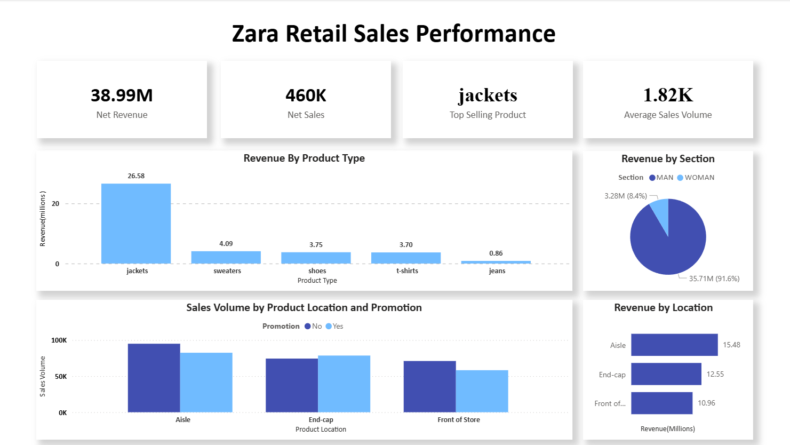

# Zara Sales Analysis

This project analyzes Zara sales patterns to determine how product category, promotion status, and product placement influence sales performance

The Project combines **SQL for querying**, **Python for exploratory analysis**, and **Power BI for further visualizations**

## Tools Used
  - MySQL
  - Python
  - Pandas
  - Matplotlib
  - NumPy
  - Power BI
  - Jupyter Notebook
    
## Questions Explored
  - Which product categories generate the most revenue?
  - Do products on promotion sell more than non-promoted products?
  - Does product position influence sales, and does product promotion amplify this?
    
## Power BI Dashboard

Interactive Power BI dashboard(download):
[Zara Sales Dashboard](powerbi/Zara_Sales_Project.pbix)

## Key Insights
- **Jackets generated more than 50% of total revenue**, making them the highest performing product category
- **Promotions only increased sales volume when products were placed on end-cap displays**
- **Products in an aisle generated 15.48 million dollars in revenue**, leading the store in terms of product location
- **The mens sections of clothing accounted for over 90% of the total revenue**

## Dataset

- Source: [Zara Sales Dataset](https://www.kaggle.com/datasets/xontoloyo/data-penjualan-zara)
- License: MIT
- Dataset snapshot date: February 19, 2024
